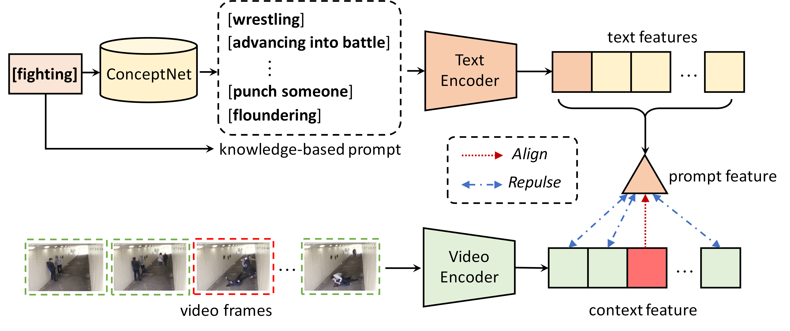

# Prompt-Enhanced Learning with CLIP

Prompt-Enhanced Learning aims to enrich potential context information via knowledge-based prompts. Therefore, we utilize [ConceptNet](https://conceptnet.io/) to extract concepts that are highly relevant to specific anomalies. 


## Approach




## Usage
1. Generate Anomaly Dictionary (.json file saved to json) by running the following command:

```
python concept_extract.py --dataset 'ucf'  # dataset:['ucf', 'xd', 'sh']
```

2. Extract prompt feature (.npy file saved to prompt_feature) by running the following command:

```
## Make sure you can run CLIP model.
python token_extract.py --dataset 'ucf'  # dataset:['ucf', 'xd', 'sh']
```
3. Move the prompt feature to ```list/dataset/``` and change the path of **token_feat** in config.py.

## Reference
[1. ConceptNet 5.5: An Open Multilingual Graph of General Knowledge](https://arxiv.org/pdf/1612.03975.pdf) [[code](https://github.com/commonsense/conceptnet5)]  
[2. Learning Transferable Visual Models From Natural Language Supervision](https://arxiv.org/pdf/2103.00020.pdf) [[code](https://github.com/openai/CLIP)]
